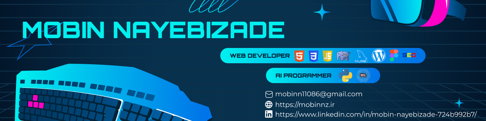

<h1 align="center">Hi 👋, I'm Mobin</h1>
<h3 align="center">Full-stack developer | Machine Learning enthusiast</h3>

 
   

- 🔭 I’m currently building **my personal website** → [mobinnz.ir](https://mobinnz.ir)

- 🌱 I’m learning **JavaScript & React** to strengthen my front-end skills

- 👨‍💻 Check out all my projects here → [GitHub/MobinDevN](https://github.com/MobinDevN)

- 💬 Ask me about **Front-end, Back-end, Machine Learning basics**

- 📫 Reach me at: **mobinn11086@gmail.com**

- ⚡ Fun fact: *I love mixing creativity with code — and yes, the Earth is still dusty 🌍✨*

<h3 align="left">Connect with me:</h3>

    

<h3 align="left">Languages and Tools:</h3>

 
     

   
  
   

   

   

   

   

   

  

  

  

  &nbsp;

  

